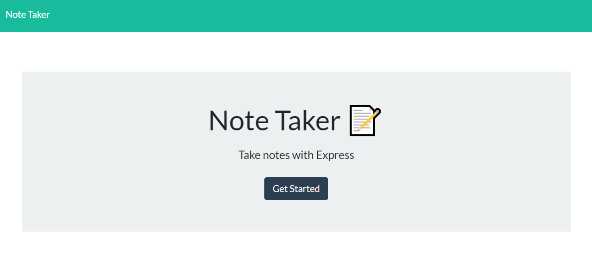
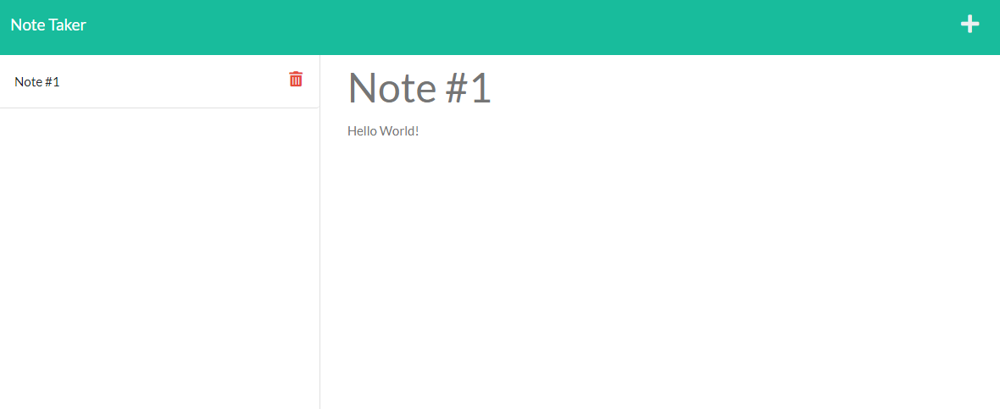

# Note Taker

This is a simple note taker that can be used to write and save notes. This application is using Express.js back end to save and retrieve your notes from a JSON file to display them on screen. It's always on a `good note` to have a handy application like this one!

## Installation

1. Download/clone my repository
2. This app requires node.js to be used.
3. Do `npm install` to install the required npm dependecies

## Usage

* This app will be ran by using the following command: `npm start`
* Open through `localhost:3001`
* Click the button called `Get Started`
* Fill in your note `title` and `text`
* Click the `save button` at the top right of page
* All of your notes will apear on the `left side` of the page
* Click on a note to display it's text
* Click on one of the `trash can` icon to `delete` a note

## Showcase

Deployed: [Note Taker](https://tye-note-taker.herokuapp.com/)

Example 1:

Example 2: 

## Features

* JavaScript
* Node
* Express
* NPM

## License

Copyright &copy; Tye Stanley. All rights reserved.
  
  Licensed under the [MIT](LICENSE) license.